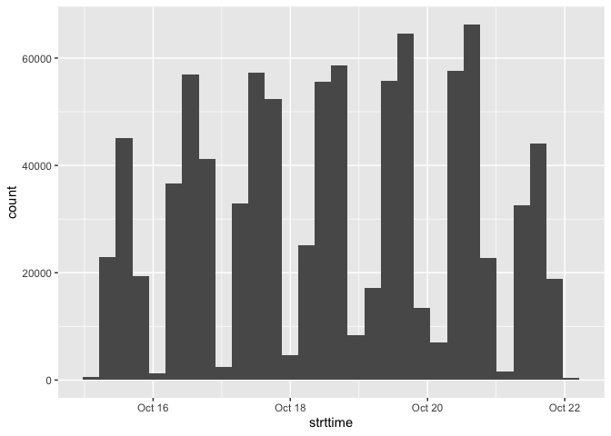

<!-- README.md is generated from README.Rmd. Please edit that file -->

# nhts2017

<!-- badges: start -->

<!-- badges: end -->

The goal of `nhts2017` is to make it considerably easier for R users to
interact with NHTS 2017 datasets. The package contains the four
datasets:

  - `nhts_households`
  - `nhts_persons`
  - `nhts_vehicles`
  - `nhts_trips`

## Installation

You can install the development version from
[GitHub](https://github.com/) with:

``` r
# install.packages("devtools")
devtools::install_github("byu-transpolab/nhts2017")
```

## Example

Each of the datasets is a properly data-typed `tibble`, derived from the
`SPSS` files distributed by [Oak Ridge National
Laboratory](https://nhts.ornl.gov/). The variables have attribute labels
that appear in RStudio’s data set viewer, and factor variables have
correct labels appended.

For instance, to count the number of households completing records for
each day, we can simply do

``` r
library(nhts2017)
library(tidyverse)
#> ── Attaching packages ─────────────────────────────────────────────────────────────────────────────────────── tidyverse 1.2.1 ──
#> ✔ ggplot2 3.2.0     ✔ purrr   0.3.2
#> ✔ tibble  2.1.3     ✔ dplyr   0.8.3
#> ✔ tidyr   0.8.3     ✔ stringr 1.4.0
#> ✔ readr   1.3.1     ✔ forcats 0.4.0
#> ── Conflicts ────────────────────────────────────────────────────────────────────────────────────────── tidyverse_conflicts() ──
#> ✖ dplyr::filter() masks stats::filter()
#> ✖ dplyr::lag()    masks stats::lag()

nhts_households %>%
  group_by(travday) %>%
  summarise(
    count = n(),
    weighted = sum(wthhfin)
  )
#> # A tibble: 7 x 3
#>   travday        count  weighted
#>   <chr+lbl>      <int>     <dbl>
#> 1 01 [Sunday]    14479 16886890.
#> 2 02 [Monday]    20045 16886895.
#> 3 03 [Tuesday]   20197 16886892.
#> 4 04 [Wednesday] 20149 16886895.
#> 5 05 [Thursday]  20484 16886894.
#> 6 06 [Friday]    20227 16886890.
#> 7 07 [Saturday]  14115 16886895.
```

In one departure from the NHTS public data files, the datasets are
`tidy` in that each field appears only once in the dataset. E.g., the
`msasize` variable — indicating the size of the metropolitan area each
household resides in — is only appended to the `nhts_households` tibble
rather than to all four tibbles. Joining is trivial, however.

``` r
nhts_trips %>%
  left_join(nhts_households, by = "houseid") %>%
  group_by(msasize) %>%
  summarise(
    mean_trip_length = weighted.mean(trpmiles, wttrdfin)
  )
#> # A tibble: 6 x 2
#>   msasize                                         mean_trip_length
#>   <chr+lbl>                                                  <dbl>
#> 1 01 [In an MSA of Less than 250,000]                         9.96
#> 2 02 [In an MSA of 250,000 - 499,999]                        11.0 
#> 3 03 [In an MSA of 500,000 - 999,999]                        10.0 
#> 4 04 [In an MSA or CMSA of 1,000,000 - 2,999,999]             9.44
#> 5 05 [In an MSA or CMSA of 3 million or more]                11.5 
#> 6 06 [Not in MSA or CMSA]                                    11.3
```

Additionally, the `strttime` and `endtime` fields on the trips data have
been converted from four-character strings (e.g. `1310` for 1:10 PM)
into R `datetime` objects. This required setting a date, which was
arbitrarily chosen to be October 10, 2017.

``` r
ggplot(nhts_trips, aes(x = strttime)) + 
  geom_histogram()
#> `stat_bin()` using `bins = 30`. Pick better value with `binwidth`.
```


